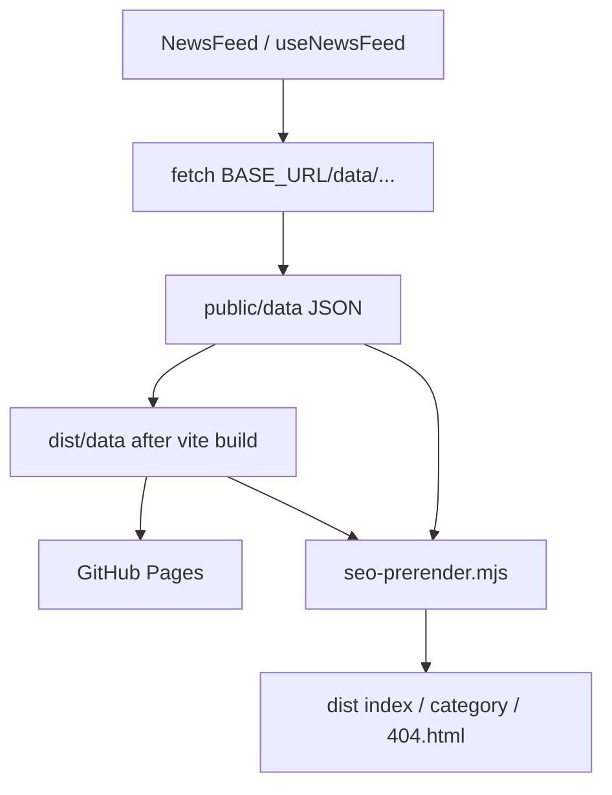

# Architecture

## Stack

- **React 19** + **Vite 8** (ESM, JSX)
- **React Router** `BrowserRouter` with `basename` derived from `import.meta.env.BASE_URL`
- **Tailwind CSS v4** via `@tailwindcss/vite`
- **react-helmet-async** for per-route document head
- **Build-time SEO prerender** (`scripts/seo-prerender.mjs`) for static HTML + crawlable lists
- Static JSON feeds (no live NewsAPI calls from the browser)

## Source layout

```
src/
  App.jsx                 # Router + HelmetProvider
  config.js               # App name, categories, countries, helpers
  components/
    layout/               # Shell, Header, Footer, ScrollTop
    news/                 # NewsFeed, ArticleCard, FeedSkeleton
    seo/PageMeta.jsx      # Title, OG, Twitter, JSON-LD
  context/CountryProvider.jsx
  hooks/useNewsFeed.js
  lib/
    dataUrl.js
    seo.js                # getRouteSeo, OG constants, prerender paths
  pages/                  # Home, Category, NotFound
scripts/
  seo-prerender.mjs       # Post-build HTML injection for crawlers
```

## Routing

| Path | Page | Feed file |
|------|------|-----------|
| `/` | Home | `everything-en-news.json` |
| `/:category` | Category (validated) | `{country}-en-{category}.json` |
| `/404` | Not found | — |

Country selection (`in` / `us`) is shown only on category routes and persisted in `localStorage`. Shared SEO copy for categories comes from `getRouteSeo` (India-oriented description); the UI feed still follows the selected country.

## Data flow



`getNewsDataUrl()` builds paths from `import.meta.env.BASE_URL`, so local `vite` preview and production Pages both resolve correctly under `/news/`.

After Vite emits `dist/`, `seo-prerender.mjs` rewrites route HTML using the same `getRouteSeo` definitions the SPA uses at runtime.

## UI principles

- Mobile-first sticky header with desktop nav + mobile chips/drawer
- Article grid collapses to a single column on small screens
- Skeleton loading instead of infinite scroll (static dumps load in one request)
- Editorial tokens in `src/index.css` (`ink`, `signal`, Fraunces + IBM Plex Sans)
